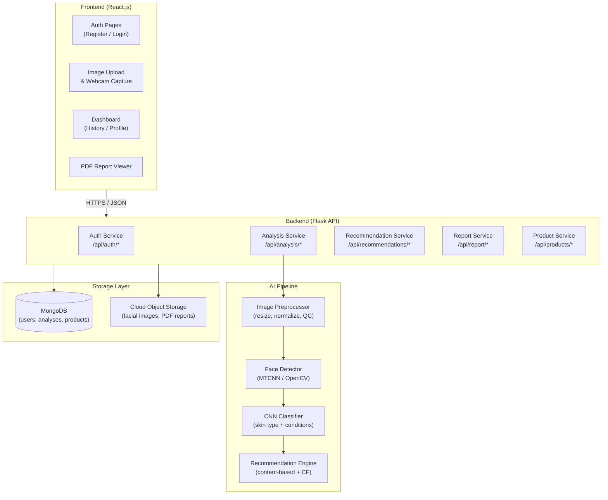
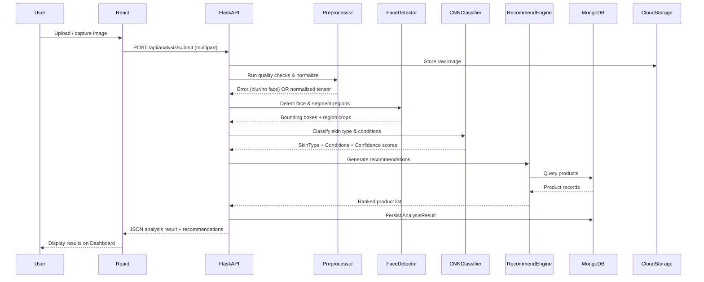

# Design Document: GlowAI – AI Powered Skin Analyzer & Cosmetic Recommendation System

## Overview

GlowAI is a full-stack web application that accepts a user's facial image, runs it through an AI pipeline to classify skin type and detect skin conditions, and returns ranked cosmetic product recommendations. The system is composed of four major layers: a React.js frontend, a Flask REST API backend, an AI inference pipeline (MTCNN + CNN), and a MongoDB data store backed by cloud object storage.

The core user journey is:
1. Register / log in
2. Upload or capture a facial image
3. Receive skin analysis results (skin type, conditions, confidence scores)
4. Browse ranked product recommendations
5. Download a PDF report

The design prioritizes a clean separation between the AI pipeline and the web API so that model versions can be updated independently of the API contract.

---

## Architecture

### High-Level Component Diagram



### Request Flow for Skin Analysis



---

## Components and Interfaces

### 1. Frontend (React.js)

| Component | Responsibility |
|---|---|
| `AuthPages` | Multi-step registration form, login form, Google OAuth button |
| `ImageCapture` | File upload input + webcam stream via `getUserMedia`, preview before submit |
| `Dashboard` | Displays current skin profile, analysis history list, recommendation cards |
| `AnalysisDetail` | Shows full result for a selected history entry with annotated image overlay |
| `RecommendationCard` | Renders product name, category, compatibility score, key ingredients |
| `ReportViewer` | Triggers PDF download, shows loading/error state |
| `ProfileEditor` | Form to update skin type, concerns, allergies; triggers recommendation refresh |

State management uses React Context + `useReducer` for auth state and analysis state. API calls are made via a central `apiClient` module (Axios) that attaches the session token to every request.

### 2. Flask API Layer

Each service module is a Flask Blueprint:

| Blueprint | Base Path | Key Endpoints |
|---|---|---|
| `auth_bp` | `/api/auth` | `POST /register`, `POST /login`, `POST /logout`, `GET /oauth/google` |
| `analysis_bp` | `/api/analysis` | `POST /submit`, `GET /history`, `GET /<analysis_id>` |
| `recommendation_bp` | `/api/recommendations` | `GET /current`, `POST /refresh` |
| `report_bp` | `/api/report` | `GET /<analysis_id>/download` |
| `product_bp` | `/api/products` | `GET /`, `POST /` (admin), `PUT /<product_id>` (admin) |
| `profile_bp` | `/api/profile` | `GET /`, `PUT /` |

A `@require_auth` decorator validates the session JWT on every protected route before the handler runs.

### 3. AI Pipeline

The pipeline is implemented as a Python module (`glowai.pipeline`) invoked synchronously from the analysis blueprint. For production scale, each stage can be extracted into a Celery task queue.

```
glowai/
  pipeline/
    preprocessor.py   # resize, normalize, blur QC
    face_detector.py  # MTCNN wrapper, region segmentation
    cnn_classifier.py # TensorFlow/Keras CNN model loader + inference
    recommender.py    # content-based + CF scoring
```

**Preprocessor interface:**
```python
def preprocess(image_bytes: bytes) -> np.ndarray:
    """Returns (224, 224, 3) float32 tensor in [0,1], raises PreprocessError on failure."""
```

**Face Detector interface:**
```python
def detect_and_segment(tensor: np.ndarray) -> FaceRegions:
    """Returns FaceRegions with bounding boxes. Raises NoFaceError or MultipleFacesError."""
```

**CNN Classifier interface:**
```python
def classify(regions: FaceRegions) -> AnalysisResult:
    """Returns AnalysisResult with skin_type, conditions, confidence scores, bboxes."""
```

**Recommender interface:**
```python
def recommend(analysis: AnalysisResult, user_profile: UserProfile) -> list[ProductScore]:
    """Returns top-10 products sorted by compatibility_score descending."""
```

### 4. Recommendation Engine

Content-based scoring uses a precomputed ingredient-condition compatibility matrix stored in MongoDB. Collaborative filtering uses cosine similarity over user skin-profile vectors (skin_type + condition flags as a binary feature vector). Final score is a weighted sum:

```
compatibility_score = α * content_score + (1 - α) * cf_score
```

where `α` defaults to 0.7 (content-based weighted higher due to cold-start problem for new users).

Allergen exclusion is applied as a hard filter before scoring — any product whose ingredient list intersects the user's declared allergens is removed from the candidate set entirely.

---

## Data Models

### MongoDB Collections

#### `users` Collection

```json
{
  "_id": "ObjectId",
  "email": "string (unique, indexed)",
  "password_hash": "string (bcrypt)",
  "first_name": "string",
  "last_name": "string",
  "phone": "string",
  "date_of_birth": "ISODate",
  "gender": "string (enum: male|female|non-binary|prefer_not_to_say)",
  "skin_profile": {
    "skin_type": "string (enum: oily|dry|combination|normal|sensitive)",
    "primary_concern": "string",
    "skin_tone": "string",
    "known_allergies": ["string"]
  },
  "oauth_provider": "string (null | google)",
  "oauth_id": "string",
  "created_at": "ISODate",
  "updated_at": "ISODate",
  "deleted_at": "ISODate (null until account deletion requested)"
}
```

#### `analyses` Collection

```json
{
  "_id": "ObjectId",
  "user_id": "ObjectId (ref: users, indexed)",
  "created_at": "ISODate (indexed)",
  "image_url": "string (cloud storage URL)",
  "skin_type": "string (enum: oily|dry|combination|normal|sensitive)",
  "skin_type_confidence": "float [0.0, 1.0]",
  "low_confidence_flag": "boolean",
  "conditions": [
    {
      "name": "string (enum: acne|dark_spots|enlarged_pores|wrinkles)",
      "confidence": "float [0.0, 1.0]",
      "bbox": {
        "region": "string (forehead|left_cheek|right_cheek|chin)",
        "x": "int", "y": "int", "w": "int", "h": "int"
      }
    }
  ],
  "face_regions": {
    "forehead": {"x": "int", "y": "int", "w": "int", "h": "int"},
    "left_cheek": {"x": "int", "y": "int", "w": "int", "h": "int"},
    "right_cheek": {"x": "int", "y": "int", "w": "int", "h": "int"},
    "chin": {"x": "int", "y": "int", "w": "int", "h": "int"}
  },
  "recommendations": [
    {
      "product_id": "ObjectId (ref: products)",
      "compatibility_score": "float [0.0, 1.0]",
      "rank": "int [1..10]"
    }
  ],
  "report_url": "string (null until PDF generated)"
}
```

#### `products` Collection

```json
{
  "_id": "ObjectId",
  "name": "string (indexed)",
  "brand": "string",
  "category": "string (enum: cleanser|moisturizer|serum|sunscreen|toner|treatment|mask)",
  "ingredients": ["string"],
  "target_skin_types": ["string (enum: oily|dry|combination|normal|sensitive)"],
  "target_conditions": ["string (enum: acne|dark_spots|enlarged_pores|wrinkles)"],
  "image_url": "string",
  "created_at": "ISODate",
  "updated_at": "ISODate"
}
```

#### `sessions` Collection (or JWT-based, no persistence needed for stateless JWT)

If using stateful sessions (for immediate invalidation on logout):

```json
{
  "_id": "ObjectId",
  "user_id": "ObjectId (ref: users)",
  "token_hash": "string",
  "created_at": "ISODate",
  "expires_at": "ISODate",
  "invalidated": "boolean"
}
```

### MongoDB Indexes

| Collection | Index |
|---|---|
| `users` | `email` (unique) |
| `analyses` | `user_id` + `created_at` (compound, descending) |
| `products` | `target_skin_types`, `target_conditions`, `ingredients` (multikey) |
| `sessions` | `token_hash` (unique), `expires_at` (TTL) |

---

## Correctness Properties

*A property is a characteristic or behavior that should hold true across all valid executions of a system — essentially, a formal statement about what the system should do. Properties serve as the bridge between human-readable specifications and machine-verifiable correctness guarantees.*

### Property 1: Registration Step Validation Rejects Missing Fields

*For any* registration step (1, 2, or 3) and any submission where one or more required fields are absent or blank, the validator should return a non-empty list of field-level errors and should not advance the user to the next step.

**Validates: Requirements 1.1, 1.2, 1.3, 1.4**

---

### Property 2: Duplicate Email Registration Rejected

*For any* email address that already exists in the `users` collection, attempting to register a new account with that same email should always return a duplicate-email error and should not create a second user record.

**Validates: Requirements 1.7**

---

### Property 3: Login Round Trip

*For any* successfully registered user, submitting their correct credentials to the login endpoint should always produce a valid, non-expired session token that grants access to protected routes.

**Validates: Requirements 2.1, 2.3**

---

### Property 4: Invalid Credentials Return Indistinguishable Error

*For any* combination of unrecognized email or incorrect password, the authentication error message returned should be identical regardless of which field was wrong — the response must not reveal whether the email or the password was the cause of failure.

**Validates: Requirements 2.2**

---

### Property 5: Logout Invalidates Token

*For any* valid session token, after the user logs out, any subsequent request to a protected endpoint using that same token should return HTTP 401.

**Validates: Requirements 2.5**

---

### Property 6: Image Format and Size Validation

*For any* uploaded file, the system should accept it if and only if its MIME type is JPEG, PNG, or WebP AND its file size is ≤ 10 MB AND its resolution is ≥ 224×224 pixels. Any file failing any of these checks should be rejected with a descriptive error.

**Validates: Requirements 3.1, 3.2, 3.4**

---

### Property 7: Preprocessor Output Invariant

*For any* image that passes all quality checks, the preprocessor output tensor should always have shape (224, 224, 3) and all pixel values should be in the range [0.0, 1.0].

**Validates: Requirements 4.1, 4.2, 4.5**

---

### Property 8: Blur Filter Rejects Low-Quality Images

*For any* image whose computed blur score is below the defined quality threshold, the preprocessor should reject it before forwarding to the face detector, and the rejection error should specify the reason.

**Validates: Requirements 4.4, 3.5**

---

### Property 9: Face Detection Region Segmentation Invariant

*For any* single-face image that passes preprocessing, the face detector should return exactly four bounding box regions (forehead, left cheek, right cheek, chin), each with valid non-negative integer coordinates.

**Validates: Requirements 5.1, 5.2, 5.5**

---

### Property 10: Face Count Error Conditions

*For any* image with zero detected faces, the face detector should raise a `NoFaceError`. *For any* image with two or more detected faces, the face detector should raise a `MultipleFacesError`. Neither error should propagate to the CNN classifier.

**Validates: Requirements 5.3, 5.4**

---

### Property 11: Classifier Output Validity Invariant

*For any* valid input to the CNN classifier, the output should satisfy all of the following simultaneously: (a) `skin_type` is one of the five valid enum values; (b) all confidence scores (skin type and all conditions) are in [0.0, 1.0]; (c) all detected condition names are from the valid condition enum; (d) each detected condition includes a bounding box with valid coordinates.

**Validates: Requirements 6.1, 6.2, 7.1, 7.2, 7.3**

---

### Property 12: Low-Confidence Flag Invariant

*For any* classification result where the highest skin-type confidence score is strictly below 0.60, the result object should have `low_confidence_flag = True`. *For any* result where the highest score is ≥ 0.60, the flag should be `False`.

**Validates: Requirements 6.3**

---

### Property 13: Condition Threshold Filter

*For any* classification result where all condition confidence scores are below 0.50, the `conditions` list in the result should be empty and the result should indicate clear skin.

**Validates: Requirements 7.4**

---

### Property 14: Analysis Persistence Round Trip

*For any* completed skin analysis for an authenticated user, after the analysis is saved, querying that user's analysis history should return a record containing the same skin type, conditions, and confidence scores that were produced by the classifier.

**Validates: Requirements 8.1, 8.2**

---

### Property 15: Recommendation Output Invariant

*For any* skin analysis result, the recommendation engine should return a list of at most 10 products where: (a) each product has a `compatibility_score` in [0.0, 1.0]; (b) the list is sorted in descending order by `compatibility_score`; (c) no two adjacent items are out of order.

**Validates: Requirements 9.1, 9.4, 9.5**

---

### Property 16: Allergen Exclusion

*For any* user with a non-empty `known_allergies` list and any recommendation output for that user, no returned product's ingredient list should contain any string that appears in the user's declared allergens.

**Validates: Requirements 9.6**

---

### Property 17: Analysis History Ordering

*For any* user with two or more analysis records, the history endpoint should return records sorted such that each record's `created_at` timestamp is greater than or equal to the next record's timestamp (newest first).

**Validates: Requirements 10.2**

---

### Property 18: Product Validation Invariant

*For any* attempt to insert or update a product record, if any required field (name, brand, category, ingredients, target_skin_types, target_conditions, image_url) is absent or null, the operation should be rejected and a validation error returned. No partial record should be persisted.

**Validates: Requirements 12.1, 12.3, 12.4**

---

### Property 19: Product Query Correctness

*For any* query to the product database filtered by a specific `skin_type` or `skin_condition`, every returned product should have that skin type or condition in its respective target list. No product outside the filter criteria should appear in results.

**Validates: Requirements 12.2**

---

### Property 20: Auth Enforcement on Protected Endpoints

*For any* protected API endpoint, a request with no token or an expired/invalidated token should always return HTTP 401. A request with a valid token should never return HTTP 401 due to authentication failure.

**Validates: Requirements 2.4, 13.2, 13.4**

---

### Property 21: Malformed Request Returns HTTP 400

*For any* API endpoint and any request with missing or malformed required parameters, the response status code should be 400 and the response body should be a JSON object containing a descriptive error message.

**Validates: Requirements 13.3, 13.5**

---

### Property 22: Password Hashing Uniqueness

*For any* two users who register with the same plaintext password, their stored `password_hash` values should be different (due to per-user salt). *For any* user, the stored `password_hash` should not equal the plaintext password.

**Validates: Requirements 14.1**

---

### Property 23: User Data Isolation

*For any* two distinct authenticated users A and B, using user A's valid session token to request user B's analysis history, profile, or individual analysis results should return HTTP 403 or HTTP 404 — never the actual data belonging to user B.

**Validates: Requirements 14.5**

---

## Error Handling

### Error Categories and Responses

| Error | HTTP Status | Response Body |
|---|---|---|
| Missing required fields | 400 | `{"error": "validation_error", "fields": [...]}` |
| Invalid image format | 400 | `{"error": "invalid_format", "message": "..."}` |
| Image too large (>10 MB) | 400 | `{"error": "file_too_large", "max_bytes": 10485760}` |
| Image below min resolution | 400 | `{"error": "resolution_too_low", "min": "224x224"}` |
| Blurred / low-quality image | 422 | `{"error": "image_quality", "reason": "blur|low_contrast"}` |
| No face detected | 422 | `{"error": "no_face_detected"}` |
| Multiple faces detected | 422 | `{"error": "multiple_faces_detected"}` |
| Unauthenticated | 401 | `{"error": "unauthorized"}` |
| Forbidden (wrong user) | 403 | `{"error": "forbidden"}` |
| Duplicate email | 409 | `{"error": "email_already_registered"}` |
| Analysis not found | 404 | `{"error": "not_found"}` |
| PDF generation failure | 500 | `{"error": "report_generation_failed", "retry": true}` |
| Internal server error | 500 | `{"error": "internal_error"}` |

### Pipeline Error Propagation

Errors in the AI pipeline are caught at each stage and converted to structured API errors before reaching the client. The pipeline never exposes raw Python exceptions or stack traces in API responses.

```
Image Upload → Preprocessor Error → 422 (quality/format)
             → Face Detector Error → 422 (no face / multiple faces)
             → CNN Error           → 500 (model inference failure)
             → Recommender Error   → 500 (recommendation failure, partial result returned)
```

For recommendation failures, the system returns the analysis result without recommendations and includes a `recommendations_available: false` flag so the frontend can display a partial result rather than a full error.

---

## Testing Strategy

### Dual Testing Approach

Both unit tests and property-based tests are required. They are complementary:
- Unit tests catch concrete bugs with specific known inputs and edge cases
- Property-based tests verify universal correctness across the full input space

### Property-Based Testing

**Library**: `hypothesis` (Python) for backend/pipeline tests; `fast-check` (TypeScript/JS) for frontend logic tests.

**Configuration**: Each property test must run a minimum of 100 iterations (Hypothesis default is 100; configure `@settings(max_examples=100)` explicitly).

**Tag format** for each test:
```python
# Feature: glow-ai-skin-analyzer, Property N: <property_text>
```

Each correctness property defined above must be implemented as exactly one property-based test. The mapping is:

| Property | Test Module | PBT Strategy |
|---|---|---|
| P1: Registration validation | `test_auth.py` | Generate random subsets of missing fields per step |
| P2: Duplicate email | `test_auth.py` | Generate random emails, register twice |
| P3: Login round trip | `test_auth.py` | Generate valid user credentials, register then login |
| P4: Indistinguishable error | `test_auth.py` | Generate wrong email vs wrong password combos |
| P5: Logout invalidates token | `test_auth.py` | Generate valid sessions, logout, retry |
| P6: Image format/size validation | `test_preprocessor.py` | Generate images of various formats, sizes, resolutions |
| P7: Preprocessor output invariant | `test_preprocessor.py` | Generate valid images of arbitrary sizes |
| P8: Blur filter | `test_preprocessor.py` | Generate images with varying blur scores |
| P9: Face region segmentation | `test_face_detector.py` | Generate single-face images |
| P10: Face count errors | `test_face_detector.py` | Generate 0-face and multi-face images |
| P11: Classifier output validity | `test_cnn_classifier.py` | Generate valid region tensors |
| P12: Low-confidence flag | `test_cnn_classifier.py` | Generate mock confidence score distributions |
| P13: Condition threshold filter | `test_cnn_classifier.py` | Generate scores all below 0.50 |
| P14: Analysis persistence round trip | `test_analysis_service.py` | Generate analysis results, persist, query |
| P15: Recommendation output invariant | `test_recommender.py` | Generate analysis results + product databases |
| P16: Allergen exclusion | `test_recommender.py` | Generate allergen lists + product ingredient lists |
| P17: History ordering | `test_analysis_service.py` | Generate multiple analyses with random timestamps |
| P18: Product validation | `test_product_service.py` | Generate product records with random missing fields |
| P19: Product query correctness | `test_product_service.py` | Generate product databases + filter queries |
| P20: Auth enforcement | `test_api.py` | Generate expired/invalid tokens for all protected routes |
| P21: Malformed request 400 | `test_api.py` | Generate requests with random missing/malformed params |
| P22: Password hashing | `test_auth.py` | Generate same password for two users, compare hashes |
| P23: User data isolation | `test_api.py` | Generate two users, attempt cross-user data access |

### Unit Testing

Unit tests focus on:
- Specific examples demonstrating correct behavior (e.g., a known skin image producing the expected skin type)
- Integration points between pipeline stages
- Edge cases: empty ingredient lists, single-pixel images, zero-length analysis history
- Error condition examples: PDF generation failure triggers retry response

**Framework**: `pytest` for backend; `Jest` + `React Testing Library` for frontend.

**Coverage target**: 80% line coverage on pipeline modules (`preprocessor.py`, `face_detector.py`, `cnn_classifier.py`, `recommender.py`) and API blueprints.

### Frontend Testing

- Component tests with React Testing Library for `ImageCapture`, `Dashboard`, `RecommendationCard`
- Mock API responses using `msw` (Mock Service Worker) to test loading, success, and error states
- Property tests with `fast-check` for pure utility functions (e.g., sorting recommendation lists, formatting confidence scores)
